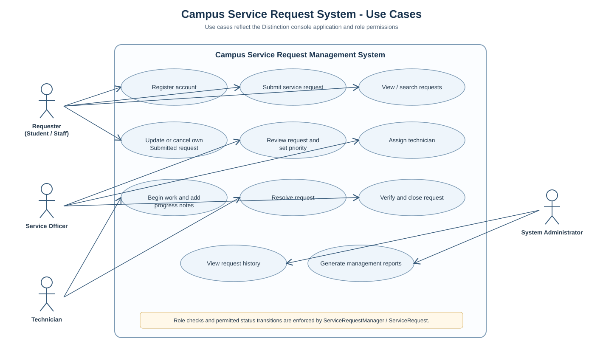
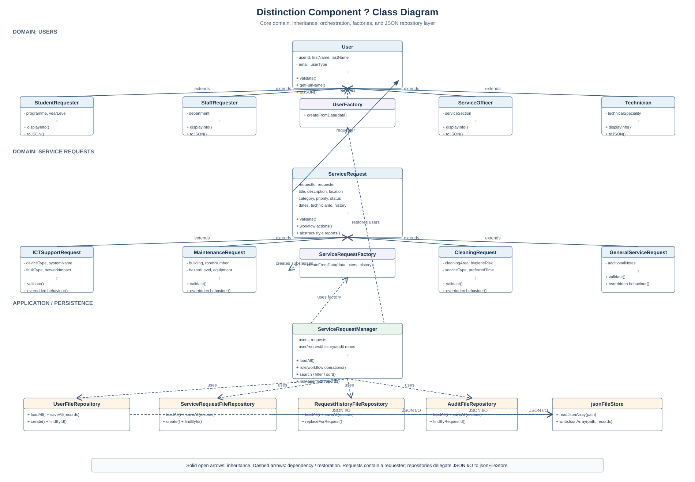
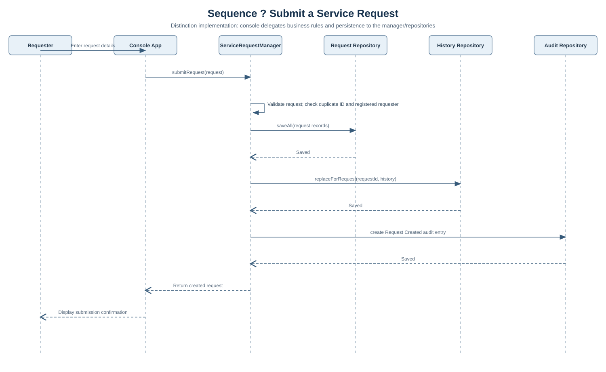
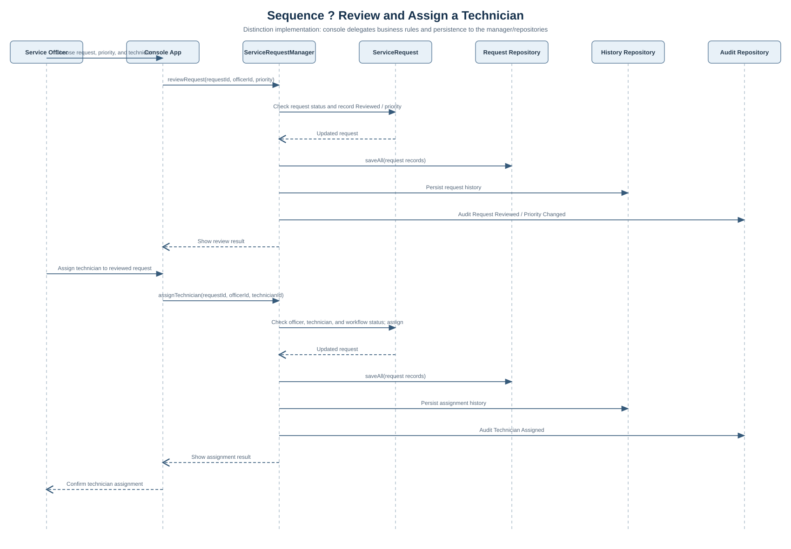
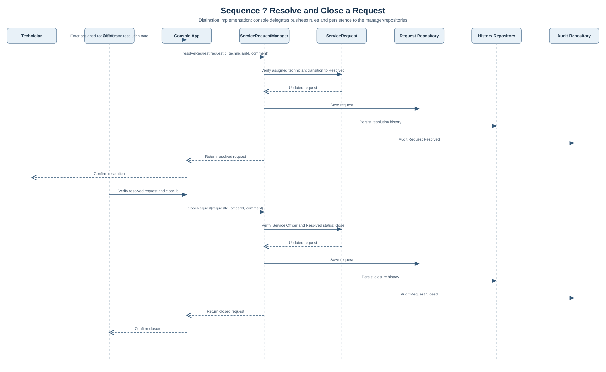

# Campus Service Request Management System
## Project File and Technical Documentation

This document provides a structured overview of the current project files in the
**Pass component**, **Credit Extension Component**, and **Distinction Component**
folders. It follows the technical-documentation requirements set out in
[Major305.docx](./Major305.docx), covering the project structure, class
responsibilities, object-oriented design, workflow logic, validation and error
handling, JSON persistence and restoration, testing, and current limitations.

The three folders represent progressive versions of the same system. The Pass
version establishes the in-memory foundation. The Credit version extends the
model with role-based workflows, specialised request classes, and stronger
status enforcement. The Distinction version adds JSON-based persistence,
object restoration, audit/history tracking, report generation, and a more
complete automated test suite.

It is important to note that these folders are not interchangeable snapshots of
one single codebase. They contain separate versions of many similarly named
classes, and the correct version should be run from its own folder.

## Project folder structure

```text
Major Project/
├── PROJECT_FILE_DOCUMENTATION.md
├── Pass component/
│   ├── CampusServiceApp.js
│   ├── passTests.js
│   ├── package.json
│   ├── README.md
│   ├── domain and manager classes (*.js)
│   └── OOP and program-run screenshots (*.png)
├── Credit Extension Component/
│   ├── CampusServiceApp.js
│   └── user, request, role, and manager classes (*.js)
└── Distinction Component/
    ├── CampusServiceApp.js
    ├── distinction.test.mjs
    ├── domain, factory, repository, and manager classes (*.js)
    └── jsonFileStore.js
```

The Distinction application is configured to use `Distinction Component/data/`
as its runtime data folder. That directory and its JSON files are not currently
included in the inventory; the file store creates them automatically the first
time data is written.

## Shared object-oriented design

Across the project, the code follows the main principles of object-oriented
programming in a practical, application-focused way:

- **Encapsulation:** `User` and `ServiceRequest` store important data in private
  fields and provide controlled access through getters, setters, and validation
  methods. Managers also encapsulate user and request collections, limiting
  direct external mutation and enforcing rules at the business-layer level.
- **Inheritance and constructor chaining:** The Credit and Distinction versions
  derive specialised requester and technician roles from `User`, and different
  service-request types from `ServiceRequest`. Shared fields are initialised via
  `super(...)`, while subclass-specific details are added afterwards.
- **Overriding and polymorphism:** Specialised request classes override methods
  such as validation, summary formatting, priority scoring, and resolution-time
  estimation. This allows the same manager code to work with diverse request
  types while producing type-appropriate behaviour.
- **Composition:** Each request is associated with a `User` object instead of
  copying the user's full identity into the request itself. In the Distinction
  version, the request factory restores the correct requester object from saved
  JSON data.

## Pass Component

The Pass version provides the original, in-memory version of the system. It
includes user and request classes, a request manager, and a menu-driven console
application. Data is not persisted to disk during normal runtime.

| File | Responsibility |
|---|---|
| `CampusServiceApp.js` | Main entry point. Displays the Pass menu, reads input, invokes the manager, and prints results or validation errors. Generates request IDs for the application flow. |
| `ServiceRequest.js` | Defines a service request with requester, description, category, priority, status, and dates. Provides controlled access, validation, updates, cancellation logic, and request summaries. |
| `ServiceRequestManager.js` | Stores users and requests in arrays and manages registration, submission, lookup, requester-based listings, updates, cancellation, searching, and status summaries. Applies uniqueness and ownership rules. |
| `User.js` | Defines a user account with private state, getters, validation, display formatting, and controlled updates. |
| `TrainingSession.js` | A small standalone class example about sessions, topics, trainers, and summaries. It is not part of the main service-request workflow. |
| `passTests.js` | Performs Pass-level checks using Node's built-in `assert` module for registration, duplicate IDs, submission rules, invalid categories, requester-specific results, and cancellation scenarios. |
| `package.json` | Declares the Pass component's metadata and its `start` and `test` scripts. |
| `README.md` | Documents setup instructions, usage, class design, validation rules, walkthrough steps, and test assumptions. |
| `Classes and objects in java.png` | Screenshot explaining the concept of classes and objects in Java. |
| `Clases and objects in java 1.png` | Screenshot showing a dog class and object example with fields and methods. The filename contains a spelling variation of “Classes”. |
| `Program run1.png` | Screenshot of JavaScript `HumanBeing` class and object code in an online editor. |
| `Program run1a.png` | Screenshot of the corresponding online editor output. |

### Pass design and workflow

The core workflow in the Pass version is straightforward and domain-focused. A
`ServiceRequest` contains a `User` requester via composition, while the manager
acts as the in-memory business layer between the objects and the menu-driven
application. The application validates both user and request data, prevents
duplicate IDs, and blocks users from acting on another user's request.

The normal request lifecycle in this version begins with user registration,
followed by request submission, request lookup or searching, permitted updates,
and cancellation. The status starts as `Submitted` and may later become
`Cancelled`.

### Pass run and test notes

The application can be run from `Pass component` using:

```bash
node CampusServiceApp.js
```

The package manifest also defines `npm start` and `npm test`. However, there is
an inconsistency in the current structure: the real test file is located at the
component root as `passTests.js`, while the package script and README examples
refer to `tests/passTests.js`. The current inventory does not include that
`tests/` directory.

## Credit Extension Component

The Credit version extends the same basic application with ES modules, more
specialised request types, user roles, workflow permissions, request history,
filtering, sorting, and richer summaries.

| File | Responsibility |
|---|---|
| `CampusServiceApp.js` | Console entry point for the Credit workflow. Imports user roles and special request classes, prompts the user for operations, and presents the extended menu. |
| `User.js` | Base user class for common identity and contact information. |
| `StudentRequester.js` | Student subclass with programme and year-level details. |
| `StaffRequester.js` | Staff subclass with department information. |
| `ServiceOfficer.js` | Service-officer subclass with service-section details and role-specific serialization behaviour. |
| `Technician.js` | Technician subclass with technical-speciality details and role-specific serialization behaviour. |
| `ServiceRequest.js` | Base request class. Stores shared request data, maintains status history, validates updates, and manages guarded workflow transitions such as review, assignment, work, resolution, and closure. |
| `ServiceRequestManager.js` | In-memory coordinator for users and requests. Enforces role permissions and workflow progression, and supports search, filtering, sorting, and status summaries. |
| `ICTSupportRequest.js` | Specialised request for ICT support issues with additional fields and validation logic. |
| `MaintenanceRequest.js` | Facilities maintenance request with building, room, hazard, and equipment details. |
| `CleaningRequest.js` | Cleaning request with area, hygiene risk, service type, and preferred timing details. |

This version demonstrates stronger inheritance design. User roles and request
categories inherit shared functionality, while each subclass adds only the
behaviour it requires. The manager enforces the intended progression from
submission through officer review and technician assignment to resolution and
final closure. Request history records each workflow change, and the manager can
filter and sort requests by category, status, priority, technician, and date.

At the time of this documentation, the Credit folder does not include a README,
package manifest, or automated test suite in the current inventory.

## Distinction Component

The Distinction version retains the same domain structure but adds persistence,
restoration, audit tracking, and reporting. Repositories deal with file storage,
factories reconstruct objects from plain data, and the manager coordinates the
full domain workflow alongside file I/O and reports.

| File | Responsibility |
|---|---|
| `CampusServiceApp.js` | Console entry point for the complete application. Connects the manager to the file repositories, loads saved data, and presents request, workflow, and report operations. |
| `User.js` | Base user class covering common fields, validation, role identity, display data, and JSON serialization. |
| `StudentRequester.js` | Student sub-class with programme and year-level details and role-specific validation behaviour. |
| `StaffRequester.js` | Staff sub-class with department details and serialization behaviour. |
| `ServiceOfficer.js` | Service-officer sub-class with service-section details and serialization behaviour. |
| `Technician.js` | Technician sub-class with technical-speciality details and serialization behaviour. |
| `UserFactory.js` | Rebuilds the correct user subclass from saved JSON so the application restores role-specific behaviour after loading data. |
| `ServiceRequest.js` | Abstract-style base request class. Defines shared state, validation, workflow transitions, history, and serialization/restore logic. |
| `ICTSupportRequest.js` | ICT-specific request subclass. Validates specialised ICT details and overrides request behaviour such as summaries, priority, and resolution estimates. |
| `MaintenanceRequest.js` | Maintenance-specific request subclass for facilities work. Validates hazard and location details and provides specialised behaviour. |
| `CleaningRequest.js` | Cleaning-specific request subclass for hygiene or cleaning service tasks. |
| `GeneralServiceRequest.js` | General campus-service subclass with custom notes and request-specific behaviour. |
| `ServiceRequestFactory.js` | Recreates the correct specialised request object from saved JSON, resolves the requester relationship, and restores status, dates, assignment, and history. |
| `ServiceRequestManager.js` | Coordinates users, requests, workflow rules, repositories, persistence, audit/history writing, filtering, sorting, and management reports. |
| `jsonFileStore.js` | Shared low-level JSON reader/writer using `fs/promises`. Creates missing parent folders, treats missing files as empty arrays, validates the array structure, and surfaces read/write errors. |
| `UserFileRepository.js` | Repository for user records, including load/save operations and user lookup, creation, and updates. |
| `ServiceRequestFileRepository.js` | Repository for request records, including load/save, creation, lookup by ID, requester, or technician, and updates. |
| `RequestHistoryFileRepository.js` | Loads and saves request-history entries, replacing the request's full history set when needed. |
| `AuditFileRepository.js` | Loads and saves audit records and supports request-specific audit retrieval. |
| `distinction.test.mjs` | Node test-runner suite. Covers constructors and validation, duplicate identities, permissions and workflow rules, polymorphic behaviour, JSON persistence/restoration, invalid data handling, and repository/reporting errors. Tests create and remove their own temporary directories. |

### Distinction data and persistence

When run from the Distinction folder, `CampusServiceApp.js` uses the `data/`
folder for four runtime JSON files:

| Runtime file | Contents |
|---|---|
| `users.json` | Serialized users and their role-specific fields. |
| `serviceRequests.json` | Serialized requests, including type, details, status, dates, and assignment data. |
| `requestHistory.json` | Workflow history records for each request. |
| `auditLog.json` | Audit records of application actions. |

The JSON files store plain records rather than live JavaScript objects. When the
application loads data, `UserFactory` and `ServiceRequestFactory` reconstruct the
correct subclass instances, restoring class behaviour as well as data. The
manager validates each change before persisting it, and file errors are surfaced
through the repository and store layers.

### Distinction OOP, workflow, and reports

The `ServiceRequest` base class defines shared state and requires specialised
request types to supply their own behaviour. The same manager and reporting code
can call methods such as `getRequestSummary()`, `calculatePriorityScore()`, and
`getTargetResolutionHours()` on different subclasses, with each subclass
providing its own implementation. This is a clear example of overriding and
polymorphism in practice.

The manager coordinates requester, officer, and technician permissions. The main
status flow includes review, assignment, work in progress, resolution, closure,
and final cancellation. Request history and audit records document the
important workflow actions. Reports cover status trends, request categories,
priority levels, urgent or overdue items, technician workload and completion
rates, resolution times, and demand by location.

### Distinction run and test notes

To run the application from the Distinction folder:

```bash
node CampusServiceApp.js
```

To run the automated tests:

```bash
node --test distinction.test.mjs
```

The Distinction test suite creates temporary data folders and removes them after
execution, so it does not rely on the normal application data files.

## UML and workflow diagrams

The following SVG diagrams are embedded in the project and saved under
`docs/diagrams/`. They describe the Distinction version's system roles, class
relationships, and workflow patterns. The source files remain the definitive
reference for exact method and field definitions.

### Use case diagram



### Class diagram



### Sequence diagram: submit a request



### Sequence diagram: review and assign a technician



### Sequence diagram: resolve and close a request



## Documentation scope and assignment alignment

The project brief's technical-documentation section specifically expects coverage
of folder structure, class responsibilities, encapsulation, inheritance and
constructor chaining, overriding and polymorphism, workflow logic, validation,
error handling, JSON persistence and restoration, test organisation, and known
limitations. This document addresses those concerns at the architecture and file
level while also including the required UML and workflow diagrams.

The brief also calls for a separate requirements document, a user guide with
console screenshots and troubleshooting notes, and a formal test report that
records inputs, expected results, actual results, outcomes, and evidence. Those
artifacts are not currently represented as existing files in the three component
folders' inventory. The Pass folder contains screenshots, but they are primarily
OOP/program examples rather than a complete user guide or test evidence set.

### Known limitations and follow-up work

- The Pass component's `package.json` test script does not match the actual
  location of `passTests.js`; the script, file placement, and README structure
  should be aligned before relying on `npm test`.
- The Credit component currently has no included automated test suite or usage
  README in the present inventory.
- No Distinction `data/` JSON files are currently included. These are runtime
  files and should contain only simulated data, never executable code,
  passwords, or confidential information.
- If persisted records fail to load at startup, the application reports the
  error and continues with an empty in-memory dataset. A later save can therefore
  overwrite previously unread data, so backups and a proper load fix should be
  handled before real project data is used.
- The separate requirements, UML, user-guide, and per-test report deliverables
  should be prepared and maintained in step with the final submitted code.

This documentation is intended to serve as a clear project map and technical
reference, while recognising that some supporting project documents still need
to be created or completed as part of the overall assignment.


